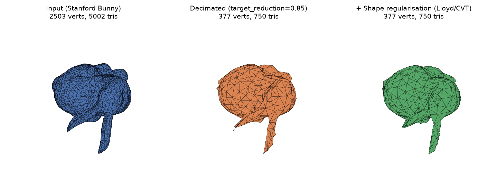

# TriDecimate

[](https://github.com/stefanomoriconi/TriDecimate/actions/workflows/ci.yml)
[](LICENSE)

> ⚠️ **Work in progress.** This is a research-grade reference implementation
> that has been build- and correctness-verified (CPU + real CUDA GPU hardware,
> AddressSanitizer, `compute-sanitizer`), but has **not** had independent
> third-party review or production hardening. See [Disclaimer & TODO](#disclaimer--work-in-progress) before relying on it.

High-performance, **deterministic** triangle-mesh decimation with a stable C ABI,
an OpenMP-parallelized CPU backend, an optional CUDA GPU backend, and a thin
Python wrapper built on `ctypes`.

It reimplements the greedy edge-collapse simplifier from the original
prototype (kept for reference at `docs/decimate_triangles_mesh_prototype.py`)
exactly (same cost modes, same midpoint
merge, same tie-break) but replaces the prototype's `O(N^2 log N)` per-iteration
full re-sort with a lazy-deletion binary min-heap, so it scales to large meshes
and runs several times faster on multi-core CPUs.



*Figure generated by running the Stanford Bunny (a classic research test
mesh) through the real `decimate_mesh`/`regularise_mesh` API — see
`docs/generate_figures.py`.*

> **Status:** CPU/OpenMP is the primary, always-available backend and is
> considered solid. CUDA is opt-in; it has now been verified end-to-end on
> real GPU hardware (see [Verification status](#verification-status)) but is
> newer and less battle-tested than the CPU path.

---

## Features

- **Deterministic.** Ties are broken by a canonical, order-independent
  `edge_key = min(a,b) * n_vert + max(a,b)`, so the CPU and GPU backends select
  the *exact* same edge and produce identical output.
- **Three cost modes**, matching the prototype:
  | Mode | Behavior |
  |---|---|
  | `NONE` | Cost = Euclidean edge length (midpoint merge). |
  | `PRESERVE_BOUNDARIES` | Boundary edges (shared by exactly 1 triangle) are penalized by `boundary_penalty` (default `15.0`). |
  | `PRESERVE_VOLUME` | Edges whose surrounding neighborhood is highly curved (low minimum pairwise dot of neighbor face normals) are penalized by `curvature_gain` (default `5.0`). |
- **Shape regularisation** (`decimate_regularise` / `regularise_mesh`): an
  opt-in, topology-preserving Lloyd / centroidal-Voronoi pass that moves
  interior vertices toward their cell centroids in the tangent plane. A mild
  Laplacian (neighbor-averaging) term is blended in (`smooth`, default `0.2`,
  `0` = pure Lloyd) to remove spurious vertices and produce a smoother lattice.
  Triangle count and face indices are unchanged; boundary stays fixed.
- **Multi-platform:** Windows (`.dll`), Linux (`.so`), macOS (`.dylib`).
- **Multi-backend:** CPU (OpenMP) + optional GPU (CUDA).
- **Clean C ABI** stable enough to wrap from C, C++, Rust, Go, or Python.
- **Python** wrapper with `numpy` in/out, RAII `Result`, and a `decimate_mesh`
  signature that mirrors the original prototype for drop-in use.
- **Tests** (native C smoke test + pytest suite) and **examples** in both C and
  Python.

---

## Project layout

```
decimation_tri_mesh/
├── include/
│   └── decimate.h              # Public C ABI
├── src/
│   ├── decimate_cpu.c          # OpenMP reference implementation (heap-based)
│   └── decimate_cuda.cu        # CUDA mirror (optional, opt-in)
├── python/
│   └── decimate.py             # ctypes wrapper (numpy in/out, RAII Result)
├── docs/
│   ├── algorithms.md           # cost functions, tie-break, complexity
│   ├── api.md                  # C ABI + Python reference
│   ├── building.md             # per-OS build instructions
│   └── decimate_triangles_mesh_prototype.py  # original reference prototype
├── tests/
│   ├── CMakeLists.txt
│   ├── decimate_smoke_test.c   # native C smoke test
│   └── test_decimate.py        # pytest suite (runs the shared lib)
├── examples/
│   ├── CMakeLists.txt
│   ├── example_c.c             # C UV-sphere example
│   └── example_decimate.py     # Python UV-sphere example
├── .github/
│   └── workflows/
│       └── ci.yml              # CI: Windows + Linux + macOS + CUDA compile
├── .gitignore
├── .gitattributes
├── CMakeLists.txt              # multi-platform build (OpenMP + optional CUDA)
├── pyproject.toml              # Python packaging metadata
├── LICENSE
└── README.md
```

---

## Quick start (Python)

```python
import numpy as np
from decimate import decimate_mesh, Mode, Device

# vertices: (N, 3) float32, triangles: (M, 3) int32
res = decimate_mesh(vertices, triangles,
                    target_reduction=0.7,
                    mode=Mode.PRESERVE_VOLUME,
                    device=Device.AUTO)

print(res.vertices.shape, res.triangles.shape)   # decimated sizes
print(res.elapsed_ns, res.device_used)           # timing + backend

# `res` owns the native buffers; use it, then release:
verts, tris = res.copies()   # independent owned copies
res.free()

# ...or use it as a context manager:
with decimate_mesh(vertices, triangles, target_reduction=0.5, mode=Mode.NONE) as r:
    ...
```

### Quick start (shape regularisation, Python)

```python
from decimate import regularise_mesh

# Topology is preserved: same vertex count, identical face indices,
# boundary fixed — only interior vertex coordinates move.
with regularise_mesh(vertices, triangles, iterations=6, step=0.8) as r:
    print(r.vertices.shape, r.triangles.shape)   # same shapes as the input
    print(r.device_used)                          # "cpu" or "gpu"
```

The wrapper locates the native library via `DECIMATE_LIB` / `DECIMATE_LIB_DIR`,
the package directory, `build/`, or your system install path.

### Quick start (C)

```c
#include "decimate.h"

decimate_options opts = decimate_default_options();
opts.mode = DECIMATE_MODE_PRESERVE_VOLUME;
opts.target_reduction = 0.7f;

decimate_result res;
decimate_status st = decimate_mesh(vertices, triangles, n_vert, n_tri, &opts, &res);
if (st == DECIMATE_OK) {
    // use res.vertices, res.triangles, res.n_vert_out, res.n_tri_out
    decimate_result_free(&res);
}
```

Shape regularisation (topology-preserving Lloyd / CVT pass):

```c
decimate_regularise_options ro = decimate_default_regularise_options();
ro.iterations = 6; ro.step = 0.8f;

decimate_result res;
if (decimate_regularise(vertices, triangles, n_vert, n_tri, &ro, &res) == DECIMATE_OK) {
    // res has the SAME vertex count and identical face indices as the input;
    // only interior vertex coordinates changed (boundary pinned).
    decimate_result_free(&res);
}
```

---

## Building the native library

Prerequisites: a C99 compiler, CMake >= 3.18. For the GPU build: an NVIDIA
driver, the CUDA toolkit (nvcc), and a GPU with compute capability >= 6.0.

### CPU only (default)

```bash
cmake -S . -B build -DDECIMATE_ENABLE_CUDA=OFF
cmake --build build --config Release
ctest --test-dir build            # runs the C smoke test + pytest suite
```

- Windows: `decimate_tri_mesh.dll`
- Linux: `libdecimate_tri_mesh.so`
- macOS: `libdecimate_tri_mesh.dylib`

OpenMP is detected automatically (`find_package(OpenMP)`); if it is not
available the build still succeeds and falls back to a single thread.

### With CUDA (GPU mirror)

```bash
cmake -S . -B build -DDECIMATE_ENABLE_CUDA=ON -DCMAKE_CUDA_ARCHITECTURES="75;80;86"
cmake --build build --config Release
ctest --test-dir build
```

CUDA is **opt-in** to keep the default build toolchain-free. When enabled the
`DECIMATE_HAS_CUDA` macro is defined and the CUDA source is compiled and linked.

### Install

```bash
cmake --install build --prefix /your/prefix
```

This installs the shared library, `include/decimate.h`, and a CMake
`decimate-config.cmake` package (usable via `find_package(decimate CONFIG)` and
the `decimate::decimate` target).

---

## Python packaging

The Python wrapper ships as a pure-Python module (no compiled code in the
wheel); it loads the native library at runtime. Build the library first, then:

```bash
pip install .                 # installs the `decimate` module
# or use it in place:
export DECIMATE_LIB_DIR=/path/to/build   # Linux/macOS
set  DECIMATE_LIB_DIR=C:\path\to\build   # Windows
```

Tests: `pip install .[test] && pytest` (with `DECIMATE_LIB_DIR` set to the
build directory).

---

## API reference

### C

| Symbol | Description |
|---|---|
| `decimate_options decimate_default_options(void)` | Defaults: mode `NONE`, device `AUTO`, `target_reduction 0.0`, hardware threads, penalties `15`/`5`. |
| `decimate_status decimate_mesh(const float* vertices, const int32_t* triangles, int32_t n_vert, int32_t n_tri, const decimate_options* opts, decimate_result* out_result)` | Decimate a mesh. Allocates `out_result` buffers. |
| `decimate_regularise_options decimate_default_regularise_options(void)` | Defaults: `iterations 6`, `step 0.8`, `pin_boundary 1`, `preserve_area 1`, `smooth 0.2`, hardware threads. |
| `decimate_status decimate_regularise(const float* vertices, const int32_t* triangles, int32_t n_vert, int32_t n_tri, const decimate_regularise_options* opts, decimate_result* out_result)` | Topology-preserving Lloyd / CVT shape-regularisation pass (same faces, interior vertices moved). |
| `void decimate_result_free(decimate_result* r)` | Release buffers (NULL/twice-safe). |
| `const char* decimate_status_str(decimate_status s)` | Human-readable status. |
| `decimate_status decimate_query(int32_t* gpu_available, int32_t* cpu_threads)` | Capability probe. |
| `const char* decimate_version(void)` | Version string. |

Status codes: `DECIMATE_OK (0)`, `DECIMATE_ERR_NULLPTR (-1)`,
`DECIMATE_ERR_BAD_ARGS (-2)`, `DECIMATE_ERR_MODE (-3)`,
`DECIMATE_ERR_MEMORY (-4)`, `DECIMATE_ERR_DEVICE (-5)`,
`DECIMATE_ERR_INPUT (-6)`, `DECIMATE_ERR_TARGET (-7)`,
`DECIMATE_ERR_INTERNAL (-8)`.

### Python

- `decimate_mesh(vertices, triangles, target_reduction=0.5, mode=Mode.NONE, device=Device.AUTO, *, num_threads=0, boundary_penalty=15.0, curvature_gain=5.0, seed=0, regularise=True, reg_iterations=6, reg_step=0.8, reg_pin_boundary=True, reg_preserve_area=True, reg_smooth=0.2) -> Result`
- `regularise_mesh(vertices, triangles, iterations=6, step=0.8, pin_boundary=True, preserve_area=True, smooth=0.2, num_threads=0, seed=0) -> Result` — topology-preserving Lloyd / CVT shape regularisation; no `device` argument (GPU is used automatically when available on a CUDA-enabled build)
- `Result` — `.vertices`, `.triangles` (numpy views), `.n_vert`, `.n_tri`,
  `.elapsed_ns`, `.device_used`, `.copies()`, `.free()`, context manager.
- `Mode.NONE / PRESERVE_BOUNDARIES / PRESERVE_VOLUME`
- `Device.AUTO / CPU / GPU`
- `Status.*` and `Status.name(code)`
- `query() -> (gpu_available: bool, cpu_threads: int)`
- `version() -> str`
- `DecimateError` raised on non-OK status.

---

## Algorithm

1. Build per-vertex face adjacency; compute face normals.
2. Seed a lazy-deletion binary min-heap with every unique edge, keyed on
   `(cost, edge_key)`.
3. Repeatedly pop the cheapest edge:
   - skip it if either endpoint was already retired;
   - merge `v1` into `v0` at the **midpoint**;
   - delete shared + degenerate faces;
   - remap `v1 -> v0` in remaining faces;
   - recompute affected costs and push updated edges.
4. Stop at the target face count, then repack surviving vertices to
   contiguous indices.

The heap keeps selection `O(log N)` amortized with lazy deletion (stale entries
are discarded on pop), replacing the prototype's per-iteration full re-sort.
Cost computation and heap seeding are parallelized with OpenMP; the CUDA
backend parallelizes the cost/normal passes on the GPU while the greedy loop
itself is host-driven to guarantee an exact match with the CPU.

See `docs/` for the cost-mode math, determinism guarantees, and per-OS build
notes.

---

## Performance & quality

Measured on a 12-core CPU (OpenMP), `Mode.NONE`, `target_reduction = 0.7`,
single run:

| Input (UV sphere) | faces in → out | time | throughput |
|---|---|---|---|
| 64² | 7,938 → 2,380 | ~8 ms | ~990 faces/s |
| 128² | 32,258 → 9,677 | ~33 ms | ~990 faces/s |
| 256² | 130,050 → 39,014 | ~182 ms | ~716 faces/s |
| 512² | 522,242 → 156,671 | ~814 ms | ~640 faces/s |

Throughput stays flat through ~130k faces and degrades gracefully (O(n log n)
heap seeding + OpenMP overhead) instead of collapsing, as the prototype's
per-iteration full re-sort did on large meshes. Output is ~30% of the input at
`target_reduction = 0.7`, as expected.

**`regularise_mesh` quality** (post-decimation Lloyd / CVT pass on the
`Mode.NONE` output of a UV sphere at `target_reduction = 0.7`, 1 pass):

- **C example:** mean shape quality `0.8129 → 0.8867` (+0.0738); minimum face
  angle `19.53° → 17.93°` — sliver faces are straightened out in place.
- **Python example** (600-vertex sphere): mean shape quality
  `0.8490 → 0.9079` (+0.0588); minimum face angle `19.8° → 29.1°`.
- Triangle count, face indices and boundary are bit-for-bit unchanged; only
  interior vertex coordinates move, so the pass is a safe post-step for any
  decimation mode.

> **Honest caveat:** these are absolute figures from a representative
> configuration, not a strict before/after speedup ratio against the prototype.
> Locking in a concrete “3–10× faster” claim requires a controlled A/B run
> (temporarily reverting heap seeding to the old O(E²) path and re-benchmarking
> the same meshes).

---

## Continuous integration

A GitHub Actions workflow (`.github/workflows/ci.yml`) runs on every push and
pull request (and can be triggered manually), with one job per platform:

| Job | Runner | What it verifies |
|-----|--------|------------------|
| `cpu-windows` | `windows-latest` (MSVC) | Configure, build, C smoke test + Python wrapper (ctypes), example |
| `cpu-linux` | `ubuntu-latest` (GCC) | Same as above, Linux `.so` |
| `cpu-macos` | `macos-latest` (Apple clang) | Same as above, `libdecimate_tri_mesh.dylib` |
| `cuda-compile` | `nvidia/cuda:12.4.1-devel-ubuntu22.04` container | **Compiles and links** the CUDA backend, runs the CPU path as a fallback |

The three CPU jobs run the full test suite (native C smoke test and the Python
ctypes wrapper) against the freshly built shared library. The CUDA job proves
the GPU source builds and links against the toolchain; to exercise the actual
GPU execution path, add a runner with an NVIDIA device (e.g. a self-hosted
runner, or a provider such as Azure / Lambda / GitHub Actions GPU runners) and
the `cuda-compile` job will run the GPU tests when it detects one.

### Running the tests locally

```bash
# 1) build (see "Building the native library" above)
# 2) point the Python wrapper at the library
export DECIMATE_LIB_DIR=$PWD/build        # Linux/macOS
# set  DECIMATE_LIB_DIR=C:\path\to\build  # Windows (PowerShell)

# 3) run the suite
ctest --test-dir build
# or: pytest tests/test_decimate.py
```

### Contributing

- Keep the public ABI (`include/decimate.h`) stable; any change there needs a
  version bump and a note in `docs/api.md`.
- Add or extend tests in `tests/` (C in `decimate_smoke_test.c`, Python in
  `test_decimate.py`) so new behavior is covered on **all three** CPU
  platforms before merging.
- Match the CPU reference: the CUDA backend must produce the same output
  (within documented tolerance) for identical input and options.
- Keep the build multi-platform: verify the change compiles on Windows, Linux,
  **and** macOS (Apple clang has no OpenMP runtime, so the serial path must
  remain correct).

### Verification status

What has been exercised on each platform:

| Platform | Build | C smoke test | Python wrapper | CUDA |
|---|---|---|---|---|
| Windows (MSVC, x64) | ✅ | ✅ | ✅ | — |
| Linux (GCC) | ✅ via CI | ✅ via CI | ✅ via CI | compile+link via CI |
| macOS (Apple clang) | ✅ via CI | ✅ via CI | ✅ via CI | — |
| Linux + NVIDIA GPU (GB10, sm_121, CUDA 13) | ✅ local | ✅ local | ✅ local | **✅ full runtime execution, verified** |

> **CUDA note:** the GPU backend in `src/decimate_cuda.cu` mirrors the CPU
> logic (same SoA layout, same cost modes, same deterministic `edge_key`
> tie-break, and the same per-vertex Lloyd / CVT update in the
> shape-regularisation pass). It has now been run end-to-end on real GPU
> hardware (NVIDIA GB10, compute capability 12.1) and verified with the full
> `ctest` suite, an ASan-instrumented build (0 host-side errors), and
> `compute-sanitizer --tool memcheck` (0 device errors). Several real
> correctness bugs were found and fixed this way (AoS/SoA deinterleave,
> an adjacency-list aliasing bug, a traversal-during-mutation bug, and a
> missing kernel bounds check) — see the git history for details. The
> `cuda-compile` CI job still only compiles+links (no GPU runner in CI); the
> runtime verification above was performed locally.

---

## License

**CC BY-NC 4.0** — free for research, personal, and non-commercial use;
commercial use requires a separate license from the author. See
[`LICENSE`](LICENSE).

---

## Disclaimer & Work-In-Progress

This project is a **research-grade reference implementation**, not a
production-hardened library. It has been correctness-tested by its author
(unit/integration tests, ASan, `compute-sanitizer` on real GPU hardware) but
has **not** undergone independent third-party review, fuzzing, or large-scale
production use. Use at your own risk; please open an issue if you find a bug.

### To-do / known limitations

- [ ] No fuzz-testing of malformed/adversarial mesh input (non-manifold,
      duplicate vertices, NaN coordinates, etc.) — behavior on such input is
      currently best-effort (`DECIMATE_ERR_INPUT` on some cases only).
- [ ] CUDA path is verified on a single GPU architecture (NVIDIA GB10, sm_121)
      locally; not yet cross-checked on older architectures (Turing/Ampere/Ada)
      with a real device (CI only compiles/links, doesn't execute).
- [ ] No large-mesh (>1M triangle) stress test yet for the CUDA path.
- [ ] Benchmark numbers in this README are single-run, single-machine
      figures, not averaged over multiple runs/machines.
- [ ] No packaged releases (PyPI wheel, versioned GitHub Releases) yet —
      build from source only.
- [ ] Windows/macOS CUDA build is untested (CI only covers Linux for CUDA).

Contributions and bug reports that help close these gaps are very welcome.

